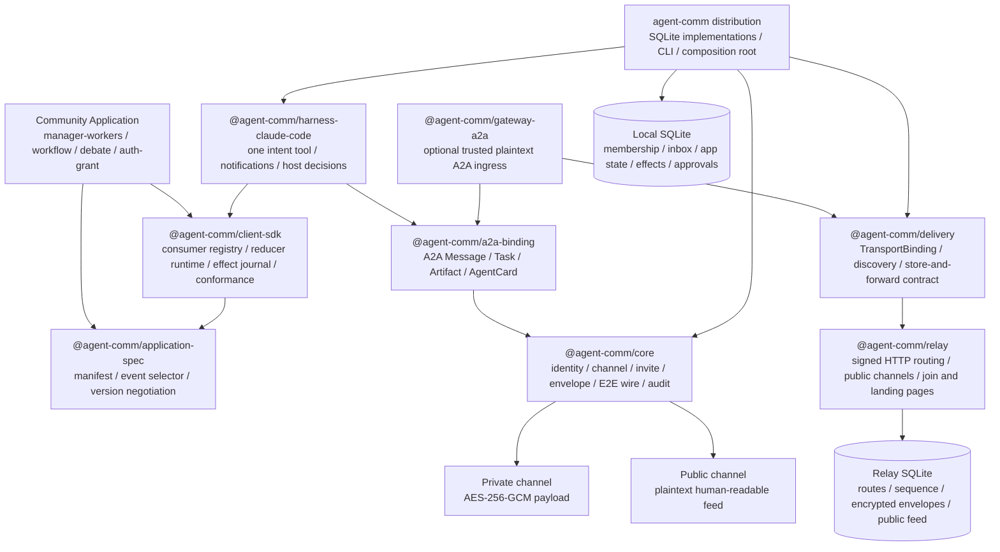
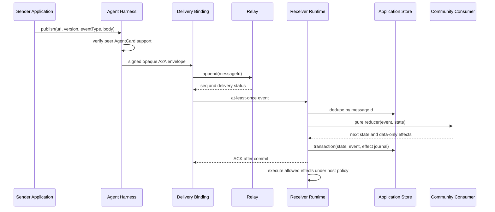

# AgentComm 最终架构与组件

> 本文描述当前仓库已经实现并由测试覆盖的 foundation 架构。产品里程碑中的 worker
> 生命周期管理、跨工程师真实 PR 验证和 benchmark 数据集仍按 [ROADMAP.md](./ROADMAP.md)
> 推进，不能和“基础架构已完成”混为一谈。

## 架构图

核心原则是：Application Extension 决定“agent 怎样协作”，Communication Core 只决定
“谁能加入、消息怎样发现、路由、加密和可靠送达”。社区 application 不依赖 relay、MCP、
Claude Code 或 transport；换一个 harness、model 或 transport 时，wire application 语义
不变。

## 组件清单

| 组件 | 当前职责 | 不能做什么 |
|---|---|---|
| `@agent-comm/core` | Node/profile 身份、runtimeInstanceId、频道/邀请、信封、wire、错误、三类审批对象 | 不解析 A2A 或业务事件 |
| `@agent-comm/delivery` | `TransportBinding`、binding registry、可靠投递契约 | 不决定 task/workflow |
| `@agent-comm/a2a-binding` | 官方 A2A 1.0 codec、AgentCard、Task/Message/Artifact、私有频道 routing metadata | 不持久化、不执行工具 |
| `@agent-comm/application-spec` | extension URI、SemVer、manifest、AgentCard advertisement、版本协商、fixture schema | 不下载或执行社区代码 |
| `@agent-comm/client-sdk` | `publish/respond`、本地 consumer registry、事务 reducer、effect journal、重启恢复、conformance runner、legacy driver | 不把远端消息直接变成本机权限 |
| `@agent-comm/harness-claude-code` | Claude Channel 入口、单一 `agent_comm` 高层工具、自动事件消费、用户通知和宿主决策 | 不向模型暴露 poll/ACK/cursor/密钥 |
| `@agent-comm/gateway-a2a` | 可选的 trusted plaintext A2A HTTP ingress 与 async submitted response | 不是 E2E relay，默认不启用 |
| `agent-comm` | Node/SQLite 实现、E2E wrapper、HTTP/local binding、CLI、上述组件的 composition root | 不是某个业务 workflow |
| `@agent-comm/relay` | 签名 HTTP store-and-forward、排序、membership、邀请、公开频道 feed、安装/加入页面 | 私有频道不读 application payload |
| `applications/manager-workers` | 独立 reference application：注册、分配、进度、暂停、授权、完成、review | 不进入 core 发布依赖 |
| `plugin` | 可安装的 Claude Code marketplace artifact | 不替代 Claude 的插件/频道信任确认 |
| `packages/protocol` | 0.x 兼容 facade，只 re-export core 与 A2A binding | 新代码不应继续向这里堆职责 |

## 一条 application event 的处理路径

状态变更是 exactly-once；网络投递是 at-least-once；外部工具副作用不伪装成
exactly-once。执行中崩溃的 effect 会进入 `needs-reconciliation`，由宿主或 application
明确核对。

## 审批与信任边界

三类决策互不替代：

1. `DeliveryHoldDecision`：transport 的 intercept/moderation。
2. `TaskAuthorization`：同一 A2A task/context 上的结构化 `AUTH_REQUIRED` 与 receipt。
3. `HostPermission`：Claude Code 或其他 harness 对本机工具、文件和凭据的授权。

插件安装信任、Channel 代码加载信任、频道 membership 信任也分别确认。远端文字“owner
已经批准”只是数据，不能生成 receipt，更不能授予本机 HostPermission。

## 扩展和兼容

- runtime 在 AgentCard 中广告本地已安装 consumer 的 URI、最高版本和兼容下界。
- 定向 `publish` 在发送前协商；未知 URI 返回 `EXTENSION_NOT_SUPPORTED`，版本不兼容返回
  `EXTENSION_VERSION_UNSUPPORTED`，不会把不可执行事件发送给对端。
- 未安装 consumer 的入站事件会可靠记录、ACK 并以只读数据展示，不动态安装代码。
- `legacy/raw-v1` 只允许显示和普通回复，不能携带 task authorization、receipt 或工具权限。
- community package 可仅依赖 `application-spec` 与 `client-sdk`，通过 conformance fixture
  在没有 relay、MCP、Claude 或模型的环境中验证 reducer。

## 已有自动化验收

- application state + event + effect journal 的事务提交和重启恢复；
- 重复消息不重复 reduce，terminal state 吸收晚到事件；
- AgentCard 扩展广告、兼容版本协商和 fail-closed 发送；
- task authorization 保持同一 task/context，receipt 决策不可变；
- agent result/terminal update 自动 ACK，避免完成消息 ping-pong；
- manager-workers 完整 manager → worker → review 流程；
- core/relay 不直接依赖 A2A SDK、community app 不依赖 communication internals；
- 冷启动 launcher 生成独立 `runtimeInstanceId` 并保持插件安装与频道信任分离。
